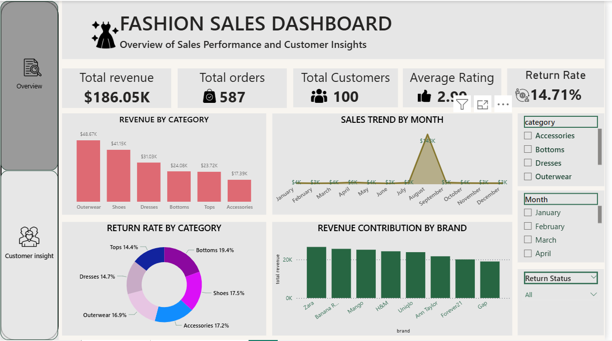
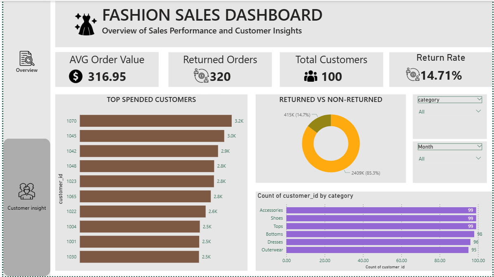

# Fashion Sales Dashboard

## Project Overview
This Power BI dashboard analyzes fashion retail sales performance, customer behavior, brand contribution, and return trends. The dashboard provides interactive insights to support business decision-making.

## Tools Used
- Power BI
- Excel
- DAX
- Power Query

## Key Features
- Sales and revenue analysis
- Customer insights dashboard
- Brand performance tracking
- Return rate analysis
- Interactive slicers and filters
- KPI monitoring

## Dashboard Screenshots

### Overview Dashboard

### Customer Insights Dashboard

## Key Insights
- Generated total revenue of $186K from 587 orders.
- Outerwear and Shoes contributed the highest revenue.
- Return rate was 14.71%.
- Identified top-spending customers and brand-wise revenue contributions.

## Files Included
- Fashion_Sales_Dashboard.pbix
- Fashion_Sales_Dataset.xlsx
- overview_dashboard.png
- customer_insights_dashboard.png
